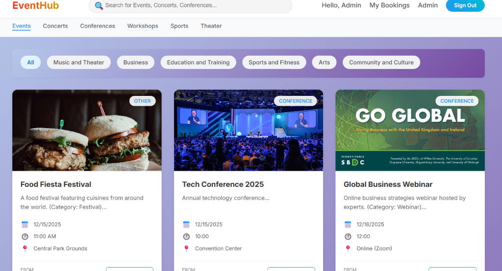
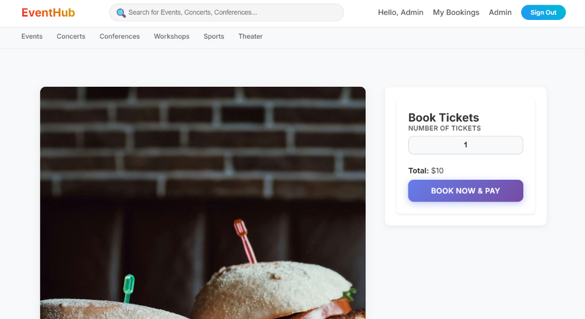
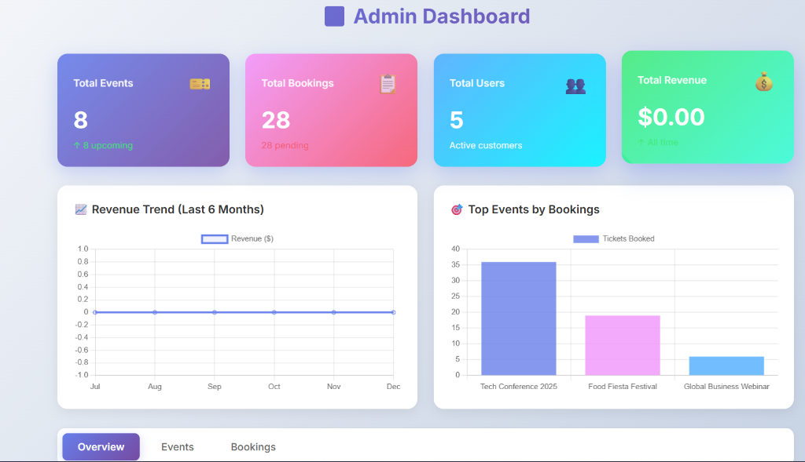

# 🎫 EventHub - Event Management & Booking Platform

<div align="center">



**A modern, full-stack event management system built with the MERN stack**

[Features](#-features) • [Screenshots](#-screenshots) • [Tech Stack](#-tech-stack) • [Installation](#-installation) • [Usage](#-usage) • [API](#-api-endpoints)

</div>

---

## 📋 Table of Contents

- [About the Project](#-about-the-project)
- [Features](#-features)
- [Screenshots](#-screenshots)
- [Tech Stack](#-tech-stack)
- [Getting Started](#-getting-started)
  - [Prerequisites](#prerequisites)
  - [Installation](#installation)
- [Usage](#-usage)
- [API Endpoints](#-api-endpoints)
- [Project Structure](#-project-structure)
- [Deployment](#-deployment)
- [Troubleshooting](#-troubleshooting)
- [License](#-license)

---

## 🎯 About the Project

**EventHub** is a comprehensive event management and booking platform that enables users to discover, book, and manage event tickets seamlessly. Built with modern web technologies, it provides a smooth experience for both event organizers (admins) and attendees (users).

### What Makes EventHub Special?

- **🎨 Modern UI/UX**: Beautiful, gradient-based design with smooth animations and responsive layouts
- **💳 Secure Payments**: Integrated PayPal payment gateway for safe transactions
- **📧 Email Notifications**: Automated booking confirmations and payment reminders
- **📊 Admin Dashboard**: Comprehensive analytics with interactive charts and statistics
- **🎯 Category Filtering**: Easy event discovery with smart category navigation
- **🔐 Role-Based Access**: Separate user and admin functionalities with JWT authentication
- **📱 Fully Responsive**: Optimized for all devices - desktop, tablet, and mobile

### Use Cases

- **Event Organizers**: Manage conferences, concerts, workshops, and sports events
- **Attendees**: Browse and book tickets for various events with ease
- **Administrators**: Monitor bookings, revenue, and user activity through analytics dashboard
- **VIP Management**: Create complimentary/VIP bookings for special guests

---

## ✨ Features

### 👤 User Features

- **🔍 Browse & Search Events**
  - View all available events with beautiful card layouts
  - Filter by category (Concerts, Conferences, Workshops, Sports, Theater)
  - Search by event name, venue, or description
  - Real-time availability updates

- **📅 Event Details & Booking**
  - Detailed event information with images
  - Interactive ticket selection
  - Real-time price calculation
  - Availability checks before booking

- **💰 Secure Payment Processing**
  - PayPal integration for safe transactions
  - Multiple payment options
  - Automatic booking confirmation on successful payment
  - Payment status tracking

- **📬 Email Notifications**
  - Booking confirmation emails
  - Payment pending reminders
  - Event reminder emails
  - Payment success notifications

- **📊 Booking Management**
  - View all personal bookings
  - Track payment status
  - Access booking history
  - Cancel bookings if needed

### 🔐 Admin Features

- **📊 Analytics Dashboard**
  - Total events, bookings, users, and revenue statistics
  - Interactive revenue trend charts (last 6 months)
  - Top events by bookings visualization
  - Clickable stat cards for quick navigation

- **🎫 Event Management**
  - Create new events with detailed information
  - Edit existing events
  - Delete events
  - Search and sort functionality
  - Manage ticket availability and pricing

- **📋 Booking Overview**
  - View all bookings across the platform
  - Filter by payment status
  - See user details and booking information
  - Send manual event reminders

- **🎁 VIP/Complimentary Bookings**
  - Create special bookings without payment
  - Assign VIP or complimentary status
  - Auto-approved bookings for special guests

### 🔧 Technical Features

- **🔐 JWT Authentication**: Secure user sessions with token-based auth
- **📱 Responsive Design**: Mobile-first, adaptive UI for all screen sizes
- **⚡ Real-time Updates**: Dynamic availability and instant feedback
- **🎨 Modern UI Components**: Glass-morphism, gradients, and smooth animations
- **🔄 State Management**: React Context API for global state
- **📡 RESTful API**: Well-structured backend with Express.js
- **🗄️ MongoDB Integration**: Mongoose ODM for data modeling
- **✅ Input Validation**: Express Validator for data integrity

---

## 📸 Screenshots

### Events Page - Browse & Filter

*Browse events with category filtering, search functionality, and beautiful card layouts*

### Event Details & Booking

*Detailed event information with real-time booking and payment processing*

### Admin Dashboard - Analytics & Management

*Comprehensive admin dashboard with statistics, charts, and management tools*

---

## 🛠️ Tech Stack

### Frontend
- **React** 18.2.0 - UI framework
- **React Router DOM** 6.16.0 - Client-side routing
- **Axios** 1.5.1 - HTTP client
- **React Toastify** 9.1.3 - Toast notifications
- **Chart.js** with React Chart.js 2 - Data visualization
- **CSS3** - Modern styling with gradients and animations

### Backend
- **Node.js** - Runtime environment
- **Express.js** 4.18.2 - Web framework
- **MongoDB** - NoSQL database
- **Mongoose** 7.5.0 - ODM for MongoDB
- **JWT** (jsonwebtoken 9.0.2) - Authentication
- **Bcrypt.js** 2.4.3 - Password hashing
- **Nodemailer** 6.9.7 - Email service
- **Express Validator** 7.0.1 - Input validation
- **CORS** 2.8.5 - Cross-origin resource sharing
- **Dotenv** 16.3.1 - Environment variables

### Payment Integration
- **PayPal SDK** - Payment processing

---

## 🚀 Getting Started

### Prerequisites

Before you begin, ensure you have the following installed:

- **Node.js** (v14 or higher) - [Download](https://nodejs.org/)
- **npm** (v6 or higher) or **yarn**
- **MongoDB** (v4.4 or higher) - [Download](https://www.mongodb.com/try/download/community)
- **PayPal Developer Account** - [Sign up](https://developer.paypal.com/)
- **Gmail Account** (for email notifications)

### Installation

#### 1. Clone the Repository

```bash
git clone <your-repo-url>
cd Event
```

#### 2. Backend Setup

Navigate to the backend directory:

```bash
cd backend
```

Install dependencies:

```bash
npm install
```

Create a `.env` file in the `backend` directory:

```env
# Server Configuration
PORT=5000
NODE_ENV=development

# Database
MONGODB_URI=mongodb://localhost:27017/eventmanagement

# JWT Configuration
JWT_SECRET=your_super_secret_jwt_key_change_this_in_production_use_minimum_32_characters
JWT_EXPIRE=7d

# PayPal Configuration
PAYPAL_CLIENT_ID=your_paypal_client_id
PAYPAL_CLIENT_SECRET=your_paypal_client_secret
PAYPAL_MODE=sandbox

# Email Configuration (Gmail)
EMAIL_HOST=smtp.gmail.com
EMAIL_PORT=587
EMAIL_USER=your_email@gmail.com
EMAIL_PASS=your_gmail_app_password

# Frontend URL
FRONTEND_URL=http://localhost:3000
```

**Important Configuration Notes:**

- **JWT_SECRET**: Generate a strong random string (32+ characters)
- **PayPal Credentials**: Get from [PayPal Developer Dashboard](https://developer.paypal.com/dashboard/)
- **Gmail App Password**: Generate from [Google Account Settings](https://support.google.com/accounts/answer/185833)

Start the backend server:

```bash
# Development mode with auto-reload
npm run dev

# Or production mode
npm start
```

The backend will run on `http://localhost:5000`

#### 3. Frontend Setup

Open a new terminal and navigate to the frontend directory:

```bash
cd frontend
```

Install dependencies:

```bash
npm install
```

Create a `.env` file in the `frontend` directory:

```env
REACT_APP_API_URL=http://localhost:5000/api
REACT_APP_PAYPAL_CLIENT_ID=your_paypal_client_id
```

Start the frontend development server:

```bash
npm start
```

The frontend will run on `http://localhost:3000` and open automatically in your browser.

---

## 💻 Usage

### Default Admin Account

The application automatically creates an admin account on first startup:

```
Email: admin@gmail.com
Password: admin123
```

**Login Flow:**
1. Navigate to `http://localhost:3000/login`
2. Enter admin credentials
3. You'll be redirected to `/admin` dashboard
4. Access all admin features including event management and analytics

### Creating User Accounts

1. Navigate to the Register page
2. Fill in your name, email, and password
3. Submit to create your account
4. Login with your credentials
5. Browse and book events!

### Booking an Event

1. Browse events on the Events page
2. Click on an event card to view details
3. Select the number of tickets
4. Click "Book Now & Pay"
5. Complete payment via PayPal
6. Receive booking confirmation email

### Admin Functions

**Dashboard Overview:**
- View real-time statistics
- Monitor revenue trends
- Track top performing events
- Click stat cards to navigate to respective sections

**Event Management:**
- Create new events with all details
- Edit existing events
- Delete events
- Search and filter functionality

**Booking Management:**
- View all platform bookings
- Create VIP/Complimentary bookings
- Monitor payment statuses
- Send event reminders

---

## 📡 API Endpoints

### Authentication Routes
```
POST   /api/auth/register      - Register new user
POST   /api/auth/login         - Login user
GET    /api/auth/me            - Get current user (Protected)
```

### Event Routes
```
GET    /api/events             - Get all events (with filters)
GET    /api/events/:id         - Get single event
POST   /api/events             - Create event (Admin only)
PUT    /api/events/:id         - Update event (Admin only)
DELETE /api/events/:id         - Delete event (Admin only)
```

### Booking Routes
```
GET    /api/bookings           - Get bookings (User's own or all for Admin)
GET    /api/bookings/:id       - Get single booking
POST   /api/bookings           - Create booking (Protected)
POST   /api/bookings/admin/complimentary - Create VIP booking (Admin only)
PUT    /api/bookings/:id       - Update booking
DELETE /api/bookings/:id       - Cancel booking
```

### Payment Routes
```
POST   /api/payments/create-order     - Create PayPal order
POST   /api/payments/capture-order    - Capture PayPal payment
POST   /api/payments/send-reminder    - Send reminder email (Admin only)
```

For detailed API documentation, see [API_DOCUMENTATION.md](./backend/API_DOCUMENTATION.md)

---

## 📁 Project Structure

```
EventHub/
├── backend/
│   ├── config/
│   │   └── db.js                  # MongoDB connection
│   ├── controllers/
│   │   ├── authController.js      # Authentication logic
│   │   ├── eventController.js     # Event CRUD operations
│   │   ├── bookingController.js   # Booking management
│   │   └── paymentController.js   # Payment processing
│   ├── middleware/
│   │   └── auth.js                # JWT auth & role middleware
│   ├── models/
│   │   ├── User.js                # User schema
│   │   ├── Event.js               # Event schema
│   │   └── Booking.js             # Booking schema
│   ├── routes/
│   │   ├── auth.js                # Auth routes
│   │   ├── events.js              # Event routes
│   │   ├── bookings.js            # Booking routes
│   │   └── payments.js            # Payment routes
│   ├── utils/
│   │   └── sendEmail.js           # Email utility
│   ├── .env                       # Environment variables
│   ├── server.js                  # Express server
│   └── package.json
│
├── frontend/
│   ├── public/
│   │   └── index.html
│   ├── src/
│   │   ├── components/
│   │   │   └── Common/
│   │   │       ├── Navbar.js      # Navigation component
│   │   │       ├── PrivateRoute.js
│   │   │       ├── AdminRoute.js
│   │   │       └── ComplimentaryBookingForm.js
│   │   ├── context/
│   │   │   └── AuthContext.js     # Authentication context
│   │   ├── pages/
│   │   │   ├── Home.js             # Landing page
│   │   │   ├── Login.js            # Login page
│   │   │   ├── Register.js         # Registration page
│   │   │   ├── Events.js           # Events listing
│   │   │   ├── EventDetail.js      # Event details & booking
│   │   │   ├── Bookings.js         # User bookings
│   │   │   ├── AdminDashboard.js   # Admin panel
│   │   │   ├── PaymentSuccess.js
│   │   │   └── PaymentCancel.js
│   │   ├── utils/
│   │   │   └── api.js              # Axios configuration
│   │   ├── App.js                  # Main app component
│   │   ├── index.js                # Entry point
│   │   └── index.css               # Global styles
│   ├── .env                        # Environment variables
│   └── package.json
│
├── screenshots/                    # Application screenshots
├── .gitignore
├── ADMIN_SETUP.md                  # Admin setup guide
├── README.md
└── STARTUP_GUIDE.md               # Quick start guide
```

---

## 🌐 Deployment

### Backend Deployment (Heroku Example)

1. Create a Heroku app:
```bash
heroku create your-app-name
```

2. Set environment variables:
```bash
heroku config:set NODE_ENV=production
heroku config:set MONGODB_URI=your_mongodb_atlas_uri
heroku config:set JWT_SECRET=your_secret
# ... set all other env variables
```

3. Deploy:
```bash
git push heroku main
```

### Frontend Deployment (Netlify/Vercel)

1. Build the production bundle:
```bash
cd frontend
npm run build
```

2. Deploy the `build` folder to:
   - **Netlify**: Drag & drop or connect GitHub
   - **Vercel**: Import project from GitHub
   - **AWS S3**: Upload to S3 bucket with CloudFront

3. Update environment variables:
   - Set `REACT_APP_API_URL` to your production backend URL
   - Set `REACT_APP_PAYPAL_CLIENT_ID` for production

### Database (MongoDB Atlas)

1. Create a free cluster on [MongoDB Atlas](https://www.mongodb.com/cloud/atlas)
2. Whitelist your IP address
3. Create a database user
4. Get your connection string
5. Update `MONGODB_URI` in backend `.env`

---

## 🔧 Troubleshooting

### Common Issues

#### MongoDB Connection Failed
```
Error: connect ECONNREFUSED 127.0.0.1:27017
```
**Solution:**
- Ensure MongoDB is running: `mongod` or check MongoDB service
- Verify connection string in `.env`
- Check if port 27017 is available

#### Port Already in Use
```
Error: listen EADDRINUSE: address already in use :::5000
```
**Solution:**
- Change `PORT` in backend `.env` to another value (e.g., 5001)
- Or kill the process using that port

#### Payment Not Working
**Solution:**
- Verify PayPal credentials in both frontend and backend `.env`
- Ensure using sandbox mode for development
- Check PayPal developer dashboard for logs

#### Email Not Sending
**Solution:**
- For Gmail, generate an App Password (not your regular password)
- Enable "Less secure app access" if using regular password
- Verify `EMAIL_USER` and `EMAIL_PASS` are correct
- Check spam folder for test emails

#### CORS Errors
**Solution:**
- Ensure `FRONTEND_URL` in backend `.env` matches your frontend URL
- Check CORS configuration in `server.js`

---

## 🔒 Security Best Practices

- ✅ Never commit `.env` files to version control
- ✅ Use strong JWT secrets (32+ characters)
- ✅ Enable HTTPS in production
- ✅ Validate all user inputs on both frontend and backend
- ✅ Use environment variables for all sensitive data
- ✅ Implement rate limiting for API endpoints
- ✅ Keep dependencies up to date
- ✅ Use prepared statements to prevent SQL injection
- ✅ Sanitize user inputs to prevent XSS attacks

---

## 📄 License

This project is created for educational and portfolio purposes.

---

## 🤝 Contributing

Contributions, issues, and feature requests are welcome!

---

## 👨‍💻 Author

**Your Name**
- GitHub: [@yourusername](https://github.com/yourusername)
- LinkedIn: [Your LinkedIn](https://linkedin.com/in/yourprofile)

---

## 🙏 Acknowledgments

- React community for excellent documentation
- MongoDB for flexible database solutions
- PayPal for secure payment integration
- Chart.js for beautiful data visualization

---

<div align="center">

**⭐ Star this repo if you find it helpful!**

Made with ❤️ using MERN Stack

</div>
